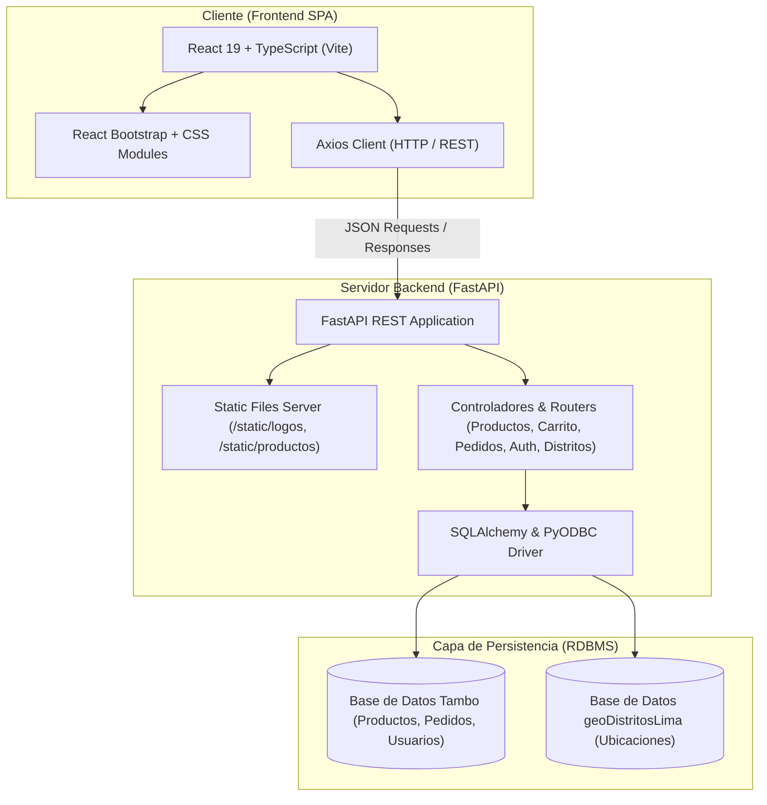

# 🟣🟡 Tambo+ E-Commerce Replica | Full-Stack Web Platform

[](https://react.dev/)
[](https://www.typescriptlang.org/)
[](https://vitejs.dev/)
[](https://fastapi.tiangolo.com/)
[](https://www.python.org/)
[](https://www.microsoft.com/sql-server)
[](https://getbootstrap.com/)

> **Proyecto Full-Stack** que replica la experiencia web de compra de **Tambo+**, la cadena de tiendas de conveniencia líder en Perú. Diseñado con una arquitectura desacoplada y escalable uniendo un frontend reactivo en **React 19 + TypeScript** y un backend de alto rendimiento con **FastAPI** y **SQL Server**.

---

## 📌 Tabla de Contenidos
- [Arquitectura del Sistema](#-arquitectura-del-sistema)
- [Características Principales](#-características-principales)
- [Stack Tecnológico](#-stack-tecnológico)
- [Estructura del Proyecto](#-estructura-del-proyecto)
- [Instalación y Configuración](#-instalación-y-configuración)
- [Endpoints Principales de la API](#-endpoints-principales-de-la-api)
- [Autor](#-autor)

---

## 🏛 Arquitectura del Sistema



---

## ✨ Características Principales

* 🛒 **Catálogo Dinámico por Categorías:** Navegación fluida entre secciones (Bebidas, Snacks, Abarrotes, Combos y Promociones) con renderizado dinámico de tarjetas de productos.
* 📍 **Selector de Ubicación Geográfica:** Modal interactivo para seleccionar distrito de cobertura en Lima Metropolitana (modalidades *Delivery* y *Recojo en Tienda*).
* 🛍️ **Carrito de Compras Reactivo:** Añadir, eliminar y modificar cantidades de productos en tiempo real con panel lateral retráctil (*Offcanvas*).
* 👤 **Sistema de Autenticación:** Modal de login y registro de usuarios para trazabilidad de compras.
* 📦 **Gestión de Pedidos:** Flujo de confirmación de pedidos conectando frontend y base de datos relacional.
* 🖼️ **Servidor de Recursos Estáticos:** Entrega optimizada de banners publicitarios, carruseles de promociones e imágenes de productos en formato WebP.

---

## 🛠 Stack Tecnológico

| Capa | Tecnología | Descripción |
| :--- | :--- | :--- |
| **Frontend** | **React 19** + **TypeScript** | Interfaz de usuario declarativa, tipada y modular. |
| **Tooling UI** | **Vite 7** | Bundler ultra rápido para desarrollo y empaquetado de producción. |
| **Estilos & UI** | **Bootstrap 5.3** + **React-Bootstrap** + **React-Icons** | Sistema de componentes responsivos y estilización temática. |
| **Backend** | **FastAPI** (Python 3.13) | Framework asíncrono de alto rendimiento para APIs REST. |
| **ORM & DB Access** | **SQLAlchemy** + **pyodbc** | Mapeo objeto-relacional y conectividad nativa a SQL Server. |
| **Base de Datos** | **Microsoft SQL Server** | Motor relacional robusto con integridad referencial. |

---

## 📂 Estructura del Proyecto

```text
ProyectoTambo/
├── Backend/                    # Servidor REST API en FastAPI
│   ├── controllers/            # Controladores de lógica de negocio y endpoints
│   ├── database/               # Configuración de sesiones SQLAlchemy
│   ├── db/                     # Conexiones nativas pyodbc
│   ├── models/                 # Modelos de datos relacionales
│   ├── schemas/                # Esquemas de validación Pydantic
│   ├── static/                 # Imágenes estáticas (logos, banners, productos)
│   ├── .env.example            # Plantilla de variables de entorno para BD
│   ├── main.py                 # Punto de entrada de la aplicación FastAPI
│   └── requirements.txt        # Dependencias de Python
│
├── client-react/               # Aplicación Frontend en React + Vite
│   ├── public/                 # Assets públicos
│   ├── src/
│   │   ├── components/
│   │   │   ├── Header/         # Cabecera, barras y navegación modular
│   │   │   │   └── Navegacion/ # Submenús, modales de login, carrito y ubicación
│   │   │   ├── Productos/      # Cards, carruseles, modales y catálogo
│   │   │   └── MainBanner.tsx  # Carrusel promocional principal
│   │   ├── App.tsx             # Componente raíz
│   │   ├── main.tsx            # Entrada de la aplicación React
│   │   ├── types.ts            # Definición de interfaces TypeScript
│   │   └── vite-env.d.ts       # Declaraciones de tipos de entorno Vite
│   ├── package.json            # Dependencias y scripts del frontend
│   └── vite.config.ts          # Configuración de Vite
│
├── .gitignore                  # Reglas de exclusión para Git (Python, Node, OS)
└── README.md                   # Documentación principal del repositorio
```

---

## 🚀 Instalación y Configuración

### 1. Clonar el repositorio
```bash
git clone https://github.com/JeanPool1234/Proyecto-Tambo.git
cd Proyecto-Tambo
```

### 2. Configurar el Backend (FastAPI)
```bash
# Navegar a la carpeta Backend
cd Backend

# Crear y activar entorno virtual (opcional pero recomendado)
python -m venv venv
venv\Scripts\activate      # En Windows

# Instalar dependencias
pip install -r requirements.txt

# Configurar variables de entorno
copy .env.example .env
# Edita .env con el nombre de tu servidor SQL Server si difiere del predeterminado

# Ejecutar el servidor de desarrollo
uvicorn main:app --reload --port 8000
```
La API estará disponible en `http://127.0.0.1:8000` y la documentación interactiva Swagger en `http://127.0.0.1:8000/docs`.

### 3. Configurar el Frontend (React + Vite)
```bash
# En una nueva terminal, navegar a client-react
cd client-react

# Instalar dependencias
npm install

# Iniciar servidor de desarrollo
npm run dev
```
La aplicación abrirá localmente en `http://localhost:5173`.

---

## 📡 Endpoints Principales de la API

* `GET /api/productosLista`: Listado general de productos disponibles.
* `GET /api/categorias`: Catálogo de categorías activas.
* `GET /api/distritosLista`: Distritos habilitados para despacho y retiro.
* `POST /api/carrito`: Gestión del carrito de compras.
* `POST /api/pedido`: Creación y procesamiento de órdenes de compra.
* `POST /api/auth/login`: Autenticación y validación de usuarios.
* `GET /static/...`: Acceso a recursos multimedia (imágenes WebP de productos y carruseles).

---

## 👨‍💻 Autor

Desarrollado con dedicación por **Jean Pool** — Ingeniero de Sistemas en formación enfocado en Desarrollo Full-Stack y Análisis de Datos.

* **GitHub:** [@JeanPool1234](https://github.com/JeanPool1234)
* **LinkedIn:** [Conectar en LinkedIn](https://www.linkedin.com)

---
*Este proyecto fue desarrollado con fines educativos y de demostración de arquitectura de software y desarrollo full-stack.*
